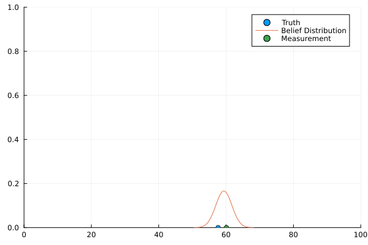
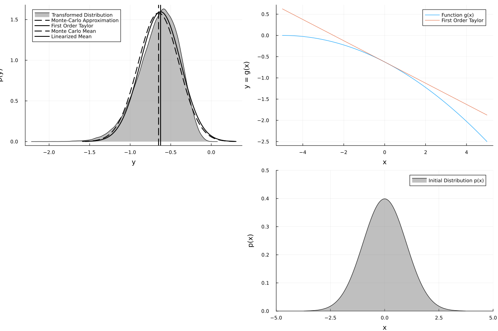
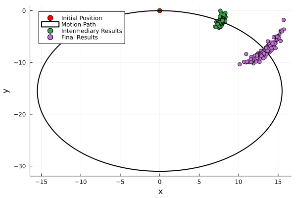
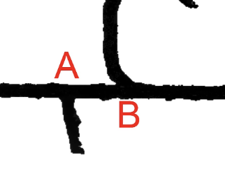
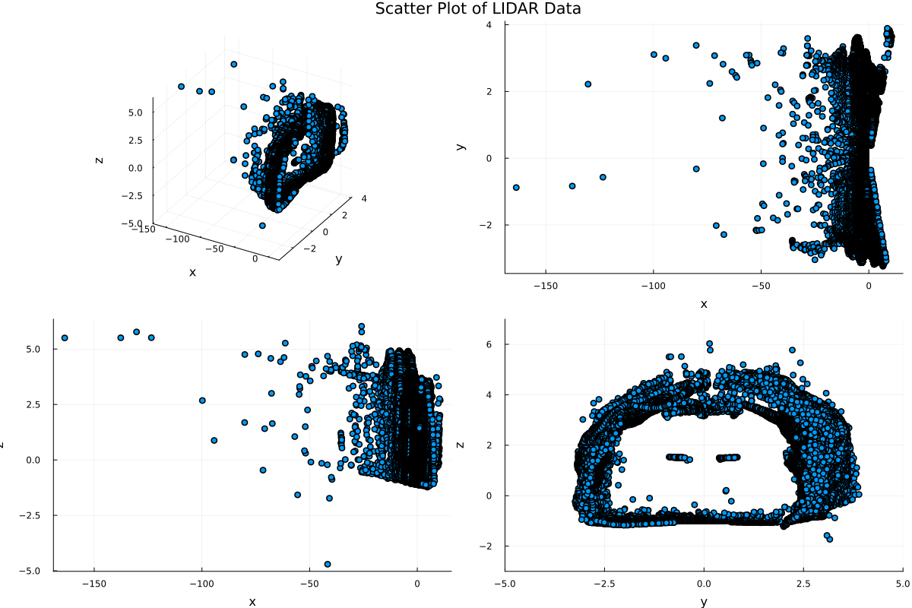
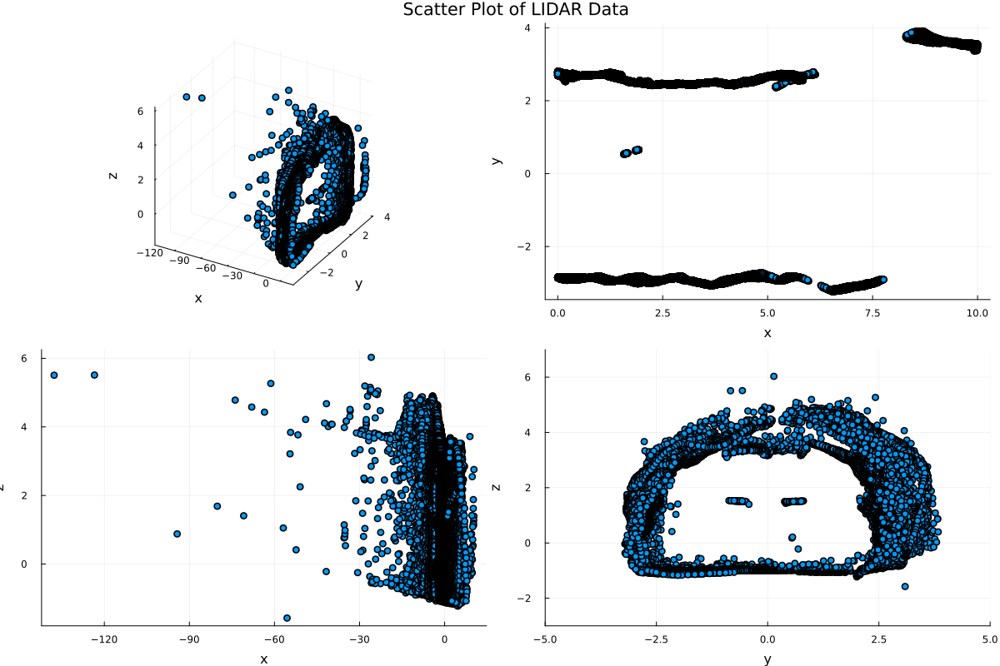

# TOY ROBOTICS EXAMPLES
Mostly reflective of the content of chapter 3 of Probabilistic Robotics by Sebastian Thrun

## INTERACTIVE_KALMAN
Toy kalman filter in 1 dimension

### Controls:
l, r to move the robot (stay within 0,100)
m to perform a measurement update

i to re initialize the program
q to quit

unfortunately these must be entered in the REPL.

### Underlying Motion Model
This simplistic robot has two controls - "l" and "r"
When either is executed, the robot attempts to move 5 units in the corresponding direction.
The actual amount moved is sampled from the ground truth distribution motion covariance Q.

### Motion Modeling
The underlying motion model is sampled as a normal distribution
Note that in this case that is correct-- the underlying motion model is normally distributed

It has estimated motion covariance Q.

### What Happens When You Move
Robot samples actual distance
Robot ground truth moves that distance

Kalman Filter estimate moves that distance, and the covariance is increased accordingly.

### Examples


## efk_transform
Generates the plots from chapter 3.3 on the EKF

### How to Use
Can either use a linear transform, or input your own non-linear function
Unfortunately this has to be done by editing the file manually

### Examples



## 2D Velocity Motion Model
Based on Chapter 5.3, Velocity Motion Model

### Alphas
Modify the alpha variables to see their effects on the resulting distribution.
The first two effect the impact of velocity and angular velocity on the velocity error
The second two impact the angular velocity error
The final pair impacts the resulting pose gamma

### Control
You can manually select a control, by modifying the initial control state.
After entering "r" into the repl, the plot will refresh with new random controls chosen from a uniform distribution.

### Using the Program
r to reload
s -> filename to save image
q to quit

### Example Outputs




## Chilean Mine SLAM Dataset Explorer

| Images | Images |
| --- | --- |
|  |  |
|  |  | 


## Jupyter Setup
To be honest this never ended up working so just ignore it.

Create a python3 virtual envrironment
```
python3 -m venv ./venv
source ./venv/bin/activate
```

Install Required Packages
```
pip install notebook=6.4.12
```

Julia Required Packages:
Only thing of note is WebSockets v1.5.9 NOT 1.6.0


## DATASETS

02S: https://dataset.amtc.cl/index.php/overview/
02S_lidar.dat.tar.bz2
02S_radar.dat.tar.bz2
02S_timing.dat.tar.bz2